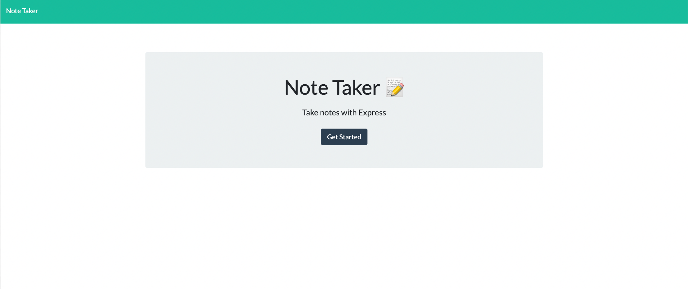
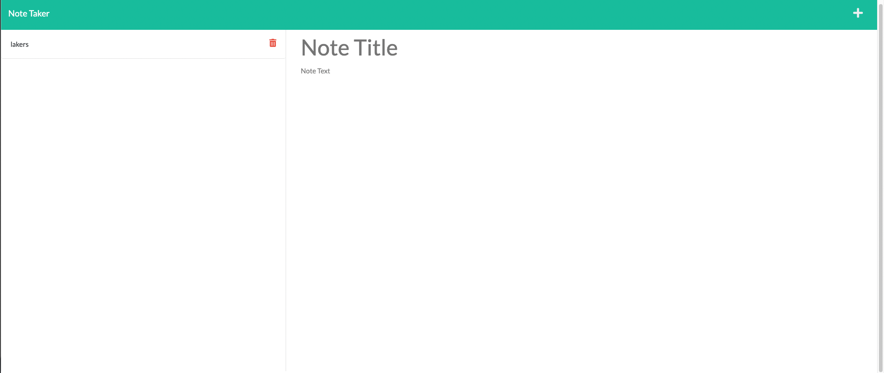

# Develop11-Express
This application allows users to save notes on a website.

# Description
This application allows users to save and delete multiple notes.

# Installation
Run 'node i'.

# Usage
Run npm start.

https://glacial-caverns-66227.herokuapp.com/

# Technologies Used
The Note Taker App uses the following technologies:
 • Node.js
 • Express
 • HTML
 • CSS
 • JavaScript
# Credits
The Note Taker App was created by [Kevin Barraza] as a project for for [Develop11-Express]

# License
This project is licensed under the MIT License.
